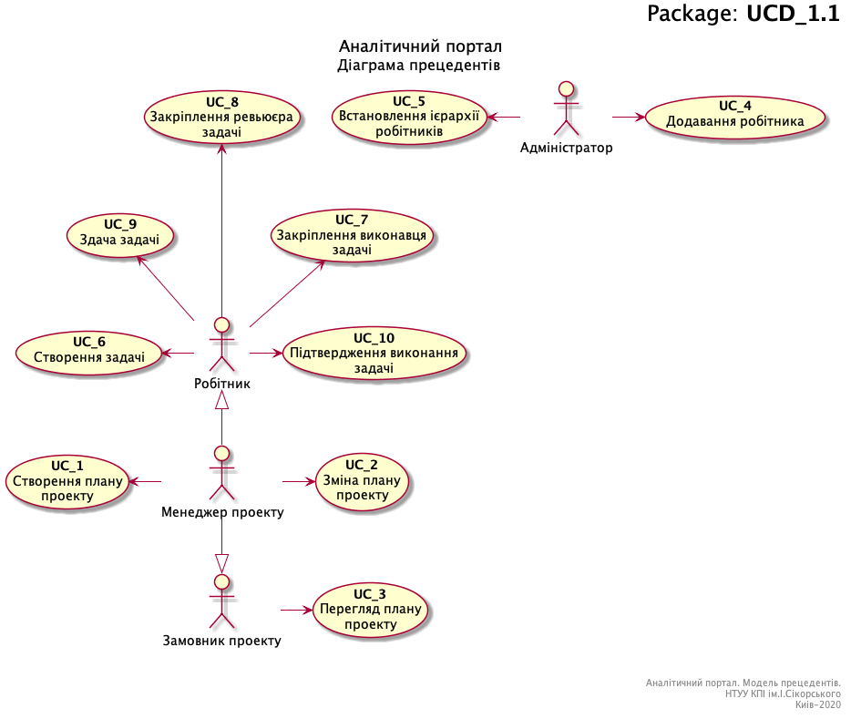

# Pear 

### **Система управління комунікаціями проектів**   Запит зацікавлених осіб

#### Версія <1.0>

****

**Історія змін**

| **Дата**   | **Версія** | **Опис**   | **Автор** |
| -----------| ---------- | ---------- | --------- |
| 29/02/2020 | <1.0>      | Чернетка   |           |
|            |            |            |           |
|            |            |            |           |
|            |            |            |           |

**Зміст**

1. [Вступ](#1)  

    1.1 [Призначення](#1-1) 

    1.2 [Сфера застосування](#1-2) 

    1.3 [Визначення, абревіатури та скорочення](#1-3) 

    1.4 [Посилання](#1-4) 

2. [Короткий огляд продукту](#2)

3. [Ділові правила і приписи](#3) 

    3.1 [Призначення Системи управління комунікаціями проектів](#3-1) 

    3.2 [Характеристика ділових процесів](#3-2) 

    3.3.[Сценарій створення плану проекту](#3-3) 

    3.4.[Сценарій зміни плану проекту](#3-4) 

    3.5.[Сценарій перегляду плану проекту](#3-5) 

    3.6.[Сценарій додавання робітника](#3-6) 

    3.7.[Сценарій встановлення ієрархії робітників](#3-7) 

    3.8.[Сценарій створення задачі](#3-8) 
    
    3.9.[Сценарій закріплення виконавця задачі](#3-9) 
    
    3.10.[Сценарій закріплення ревьюєра задачі](#3-10) 
    
    3.11.[Сценарій здачі задачі](#3-11) 
    
    3.12.[Сценарій підтвердження виконання задачі](#3-12) 

4. [Функціональність](#4) 

    

****

**Запит зацікавлених осіб**

### **1.Вступ**

У цьому документі описуються запити зацікавлених осіб, в якості яких виступають представники компанії «Pear», по відношенню до розроблюваної Системи управління комунікаціями проектів.

​**1.1.Призначення**

Метою документа є визначення основних вимог до функціональності, продуктивності і експлуатаційної придатності, а також визначення бізнес-правил і технологічних обмежень, що пред'являються до предмету розробки.

**1.2.Сфера застосування**

Перелік вимог, перерахованих в цьому документі, є основою технічного завдання на розробку Системи управління комунікаціями проектів.

**1.3.Визначення, абревіатури та скорочення**

Визначення всіх термінів, абревіатур та скорочень, необхідних для правильної інтерпретації Запиту зацікавлених осів розташована у Глосарії проекту: https://github.com/pavlovskyive/project_management_system/blob/master/Documentation/Glossary.md

​ **1.4.Посилання**

Глосарії проекту: https://github.com/pavlovskyive/project_management_system/blob/master/Documentation/Glossary.md

### **2.Короткий огляд продукту**

Система управління комунікаціями проектів являє собою програмне забезпечення для комплексного керування комунікаціями в межах проекту.

### **3.Ділові правила і приписи**

**3.1.Призначення Системи управління комунікаціями проектів**

Цілями комунікації є:
1. Забезпечення ефективного обміну інформацією між суб’єктами і об’єктами управління.
2. Удосконалення міжособистісних відносин в процесі обміну інформацією.
3. Створення інформаційних каналів для обміну інформацією між окремими працівниками та групами та координації їх завдань і дій.
4. Регулювання та раціоналізація інформаційних потоків.

Таким чином функціональність Системи управління комунікаціями проектів напрямлена на підтримку системи зв'язку між учасниками проекту, передачу управлінської та звітної інформації, спрямованої на забезпечення досягнення цілей проекту.

**3.2.Характеристика ділових процесів**

Керування Системою управління комунікаціями проектів здійснює менеджер проекту (керівник проекту). Менеджер зі сторони управління комунікаціями проектів несе відповідальність за планування системи комунікацій, збір і розподіл інформації, оцінку і відображення прогресу а також за документування інформації.

Виконавець роботи передає інформацію про поточний стан виконання поставленої задачі і надсилає фідбек щодо умов праці та проблем, що виникають.

**3.3.Сценарій створення плану проекту**

**3.4.Сценарій зміни плану проекту**

**3.5.Сценарій перегляду плану проекту**

**3.6.Сценарій додавання робітника**

**3.7.Сценарій встановлення ієрархії робітників**

**3.8.Сценарій створення задачі**

**3.9.Сценарій закріплення виконавця задачі**

**3.10.Сценарій закріплення ревьюєра задачі**

**3.11.Сценарій виконання задачі**

**3.12.Сценарій підтвердження виконання задачі**

### **4.Функціональність**

